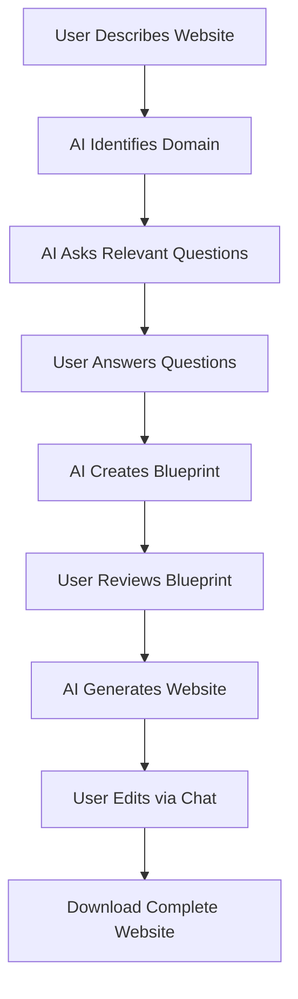

# Studio TZ - Complete Project Documentation

## 📋 Table of Contents
1. [Project Overview](#project-overview)
2. [How It Works](#how-it-works)
3. [Technology Stack](#technology-stack)
4. [System Architecture](#system-architecture)
5. [Core Features](#core-features)
6. [AI Agents & Their Roles](#ai-agents--their-roles)
7. [API Endpoints](#api-endpoints)
8. [Frontend Components](#frontend-components)
9. [User Journey](#user-journey)
10. [File Structure](#file-structure)

---

## 🎯 Project Overview

**Studio TZ** (also known as **NCD INAI**) is an AI-powered website builder that transforms natural language descriptions into production-ready websites. Users simply describe what kind of website they want in plain English, and the AI generates complete HTML, CSS, and JavaScript code.

### What Makes It Special?
- **Zero Coding Required**: Users describe their needs in natural language
- **Intelligent Understanding**: AI identifies business domain and asks relevant questions
- **Visual Blueprint**: Preview website structure before generation
- **Live Editing**: Chat-based modifications with surgical precision
- **Production Ready**: Generates clean, downloadable code

---

## 🔄 How It Works

### Step-by-Step Process:



### Detailed Flow:

1. **Session Creation**
   - User starts by creating a new session
   - System generates unique session ID
   - Session tracks entire website building process

2. **Intent Processing**
   - User describes website (e.g., "I want a restaurant website")
   - Domain Identifier Agent analyzes the description
   - Classifies business type (restaurant, portfolio, e-commerce, etc.)

3. **Smart Questioning**
   - Question Generator Agent creates domain-specific questions
   - For restaurant: "What's your restaurant name?", "What cuisine?", "Do you offer delivery?"
   - For portfolio: "What's your profession?", "What services do you offer?"
   - User provides answers

4. **Blueprint Creation**
   - Blueprint Architect Agent designs website structure
   - Creates page layouts, sections, and components
   - User can review and approve the plan

5. **Code Generation**
   - Code Generator Agent produces actual HTML, CSS, and JavaScript
   - Uses Groq AI (Kimi K2 model) for high-quality code
   - Generates multi-page websites with proper structure

6. **Live Editing**
   - User can chat to make changes: "Make the button red"
   - Editor Agent understands and applies changes
   - Surgical Edit System ensures precise modifications
   - Version control tracks all changes

7. **Download & Deploy**
   - User downloads complete website as ZIP file
   - All files ready for deployment
   - Can be hosted on any web server

---

## 🛠️ Technology Stack

### Backend (Python)
- **FastAPI**: High-performance web framework
- **LangChain + LangGraph**: AI agent orchestration
- **Groq API**: LLM provider (Kimi K2 model for generation, Llama 3.3 for questions)
- **BeautifulSoup**: HTML parsing and manipulation
- **Pydantic**: Data validation
- **Python 3.9+**: Core language

### Frontend (TypeScript/React)
- **Next.js 14**: React framework with App Router
- **React 19**: UI library
- **TypeScript**: Type-safe JavaScript
- **Monaco Editor**: Code viewing/editing
- **Tailwind CSS**: Styling framework
- **CSS Modules**: Component-scoped styles

### AI Models
- **Primary Model**: `moonshotai/kimi-k2-instruct-0905` (code generation, blueprints)
- **Question Model**: `llama-3.3-70b-versatile` (faster for simple tasks)

---

## 🏗️ System Architecture

### Backend Structure

```
backend/
├── app/
│   ├── agents/              # AI Agents
│   │   ├── domain_identifier.py    # Identifies business domain
│   │   ├── question_generator.py   # Generates domain-specific questions
│   │   ├── blueprint_architect.py  # Creates website structure
│   │   ├── code_generator.py       # Generates HTML/CSS/JS
│   │   ├── editor.py               # Plans edits
│   │   └── validator.py            # Validates generated code
│   │
│   ├── routers/             # API Endpoints
│   │   ├── session.py       # Session management
│   │   ├── intent.py        # Intent processing
│   │   ├── questions.py     # Question handling
│   │   ├── blueprint.py     # Blueprint creation
│   │   ├── generate.py      # Website generation
│   │   ├── edit.py          # Editing system
│   │   ├── theme.py         # Theme customization
│   │   ├── assets.py        # Asset management
│   │   └── deploy.py        # Deployment
│   │
│   ├── services/            # Business Logic
│   │   ├── session_manager.py      # Session state management
│   │   ├── file_manager.py         # File operations
│   │   ├── component_registry.py   # Component tracking
│   │   ├── edit_history.py         # Version control
│   │   └── safe_edit_engine.py     # Surgical edits
│   │
│   ├── models/              # Data Models
│   │   ├── session.py       # Session models
│   │   ├── website.py       # Website models
│   │   └── ...
│   │
│   ├── config.py            # Configuration
│   └── main.py              # Application entry point
│
└── projects/                # Generated websites storage
```

### Frontend Structure

```
frontend/
├── src/
│   ├── app/
│   │   ├── builder/[sessionId]/    # Website builder pages
│   │   │   ├── page.tsx            # Main builder interface
│   │   │   ├── questions/          # Questions step
│   │   │   ├── blueprint/          # Blueprint review
│   │   │   ├── preview/            # Website preview
│   │   │   └── edit/               # Editing interface
│   │   └── page.tsx                # Home page
│   │
│   ├── components/
│   │   ├── features/               # Feature components
│   │   │   ├── MonacoCodeViewer.tsx    # Code viewer
│   │   │   ├── ThemePanel.tsx          # Theme customization
│   │   │   ├── AssetManager.tsx        # Asset upload
│   │   │   └── PageManager.tsx         # Multi-page management
│   │   └── ...
│   │
│   └── lib/                        # Utilities
│
└── public/                         # Static assets
```

---

## ✨ Core Features

### 1. **Natural Language Interface**
- Users describe websites in plain English
- No technical knowledge required
- AI understands context and intent

### 2. **Domain Detection**
- Automatically identifies business type
- Supports 20+ domains:
  - Restaurant, Flower Shop, Portfolio, Agency
  - E-commerce, SaaS, Blog, Nonprofit
  - Medical, Legal, Real Estate, Education
  - Fitness, Beauty, Photography, Construction
  - Automotive, Travel, Event Planning, Tech Startup

### 3. **Smart Questioning System**
- Domain-specific questions
- Gathers essential information
- Customizes website based on answers

### 4. **Visual Blueprint**
- Preview website structure before generation
- See pages, sections, and components
- Approve or request changes

### 5. **Multi-Page Website Generation**
- Generates complete websites with multiple pages
- Proper navigation between pages
- Consistent styling across all pages

### 6. **Theme Customization**
- Change color schemes
- Modify fonts
- Adjust layouts
- Real-time preview

### 7. **Asset Management**
- Upload images
- Manage files
- Replace placeholders with real content

### 8. **Surgical Edit System**
- Chat-based editing: "Change the heading to Welcome"
- Precise modifications using NCD IDs
- Version control with rollback capability
- Edit history tracking

### 9. **Code Viewing**
- Monaco Editor integration
- Syntax highlighting
- View HTML, CSS, and JavaScript
- Read-only code inspection

### 10. **One-Click Download**
- Export complete website as ZIP
- All files organized properly
- Ready for deployment

---

## 🤖 AI Agents & Their Roles

### 1. **Domain Identifier Agent**
**File**: `backend/app/agents/domain_identifier.py`

**Purpose**: Identifies the business domain from user's description

**How It Works**:
- Analyzes user's intent description
- Classifies into specific domain (restaurant, portfolio, etc.)
- Provides confidence score
- Extracts keywords and business type

**Example**:
```
Input: "I want a website for my Italian restaurant"
Output: {
  domain: "restaurant",
  industry: "food_service",
  business_type: "local_business",
  keywords: ["italian", "restaurant", "dining"],
  confidence: 0.95
}
```

### 2. **Question Generator Agent**
**File**: `backend/app/agents/question_generator.py`

**Purpose**: Creates domain-specific questions to gather requirements

**How It Works**:
- Takes domain classification
- Generates 5-8 relevant questions
- Questions tailored to business type
- Helps gather essential information

**Example for Restaurant**:
- "What is your restaurant's name?"
- "What type of cuisine do you serve?"
- "Do you offer delivery or takeout?"
- "What are your operating hours?"

### 3. **Blueprint Architect Agent**
**File**: `backend/app/agents/blueprint_architect.py`

**Purpose**: Designs website structure and layout

**How It Works**:
- Takes domain, answers, and user intent
- Creates page structure (Home, About, Services, Contact, etc.)
- Defines sections for each page
- Plans components and features

**Output**:
```json
{
  "pages": [
    {
      "name": "Home",
      "sections": ["Hero", "Menu Highlights", "About", "Contact"]
    },
    {
      "name": "Menu",
      "sections": ["Categories", "Items", "Specials"]
    }
  ]
}
```

### 4. **Code Generator Agent**
**File**: `backend/app/agents/code_generator.py`

**Purpose**: Generates actual HTML, CSS, and JavaScript code

**How It Works**:
- Takes blueprint and requirements
- Generates clean, semantic HTML
- Creates responsive CSS
- Adds interactive JavaScript
- Produces multi-file structure

**Features**:
- Modern, responsive design
- Clean code structure
- Accessibility features
- SEO-friendly markup
- Cross-browser compatible

### 5. **Editor Agent**
**File**: `backend/app/agents/editor.py`

**Purpose**: Plans and executes edits to generated websites

**How It Works**:
- Understands natural language edit requests
- Plans appropriate actions (UPDATE_TEXT, UPDATE_STYLE, etc.)
- Provides reasoning for changes
- Works with Surgical Edit System

**Example**:
```
Input: "Make the button red"
Output: {
  action: "UPDATE_STYLE",
  parameters: {
    property: "background-color",
    value: "red"
  },
  reasoning: "Changing button background color to red"
}
```

### 6. **Validator Agent**
**File**: `backend/app/agents/validator.py`

**Purpose**: Validates generated code for quality and correctness

**How It Works**:
- Checks HTML structure
- Validates CSS syntax
- Ensures JavaScript correctness
- Verifies responsiveness
- Checks accessibility

---

## 🔌 API Endpoints

### Session Management

#### `POST /api/session/create`
Creates a new website building session
```json
Response: {
  "session_id": "session_39a5e4cd-25a0-449d-a1a3-34935bf14712",
  "status": "created",
  "created_at": "2025-12-22T12:00:00Z"
}
```

### Intent Processing

#### `POST /api/intent`
Processes user's website description
```json
Request: {
  "session_id": "...",
  "intent": "I want a restaurant website"
}

Response: {
  "domain": "restaurant",
  "industry": "food_service",
  "confidence": 0.95
}
```

### Questions

#### `GET /api/questions/{session_id}`
Gets domain-specific questions
```json
Response: {
  "questions": [
    {
      "id": "q1",
      "text": "What is your restaurant's name?",
      "type": "text"
    }
  ]
}
```

#### `POST /api/answers/{session_id}`
Submits answers to questions
```json
Request: {
  "answers": {
    "q1": "Bella Italia",
    "q2": "Italian cuisine"
  }
}
```

### Blueprint

#### `GET /api/blueprint/{session_id}`
Retrieves website blueprint
```json
Response: {
  "pages": [...],
  "theme": {...},
  "features": [...]
}
```

### Generation

#### `POST /api/generate/{session_id}`
Generates the website
```json
Response: {
  "success": true,
  "files": [
    {"path": "index.html", "content": "...", "file_type": "html"}
  ],
  "preview_url": "/projects/session_.../index.html"
}
```

### Editing

#### `POST /api/edit/{session_id}/chat`
Chat-based editing
```json
Request: {
  "message": "Change the heading to Welcome"
}

Response: {
  "success": true,
  "changes": [...],
  "message": "Updated the heading",
  "preview_url": "..."
}
```

#### `POST /api/edit/{session_id}/structured`
Structured editing with NCD ID
```json
Request: {
  "ncd_id": "ncd-heading-1",
  "instruction": "Change to Welcome",
  "current_value": "Hello"
}
```

#### `GET /api/edit/{session_id}/history`
Get edit history with version control

#### `POST /api/edit/{session_id}/rollback`
Rollback to previous version

### Theme Customization

#### `POST /api/theme/{session_id}/apply`
Apply theme changes
```json
Request: {
  "colors": {
    "primary": "#ff0000",
    "secondary": "#00ff00"
  },
  "fonts": {
    "heading": "Roboto",
    "body": "Open Sans"
  }
}
```

### Asset Management

#### `POST /api/assets/{session_id}/upload`
Upload images and files

#### `GET /api/assets/{session_id}/list`
List all uploaded assets

### Deployment

#### `GET /api/download/{session_id}`
Download complete website as ZIP file

---

## 🎨 Frontend Components

### 1. **MonacoCodeViewer**
**File**: `frontend/src/components/features/MonacoCodeViewer.tsx`

- Monaco Editor integration (VS Code editor)
- Syntax highlighting for HTML, CSS, JavaScript
- Read-only code viewing
- Line numbers and minimap
- Theme support (dark/light)

### 2. **ThemePanel**
**File**: `frontend/src/components/features/ThemePanel.tsx`

- Color picker for primary/secondary colors
- Font selection
- Layout options
- Real-time preview
- Apply/reset functionality

### 3. **AssetManager**
**File**: `frontend/src/components/features/AssetManager.tsx`

- Drag-and-drop file upload
- Image preview
- File size validation
- Delete functionality
- Replace placeholders in website

### 4. **PageManager**
**File**: `frontend/src/components/features/PageManager.tsx`

- View all pages in website
- Add new pages
- Delete pages
- Navigate between pages
- Page templates

### 5. **CodeViewer**
**File**: `frontend/src/components/features/CodeViewer.tsx`

- Simple code viewer (fallback)
- Syntax highlighting
- File tabs
- Copy to clipboard

---

## 👤 User Journey

### Complete Workflow Example:

**Scenario**: User wants to create a restaurant website

1. **Start**
   - User visits Studio TZ
   - Clicks "Create New Website"
   - System creates session

2. **Describe Intent**
   - User types: "I want a website for my Italian restaurant"
   - AI identifies domain: Restaurant
   - Confidence: 95%

3. **Answer Questions**
   - Q: "What is your restaurant's name?"
     A: "Bella Italia"
   - Q: "What type of cuisine?"
     A: "Italian"
   - Q: "Do you offer delivery?"
     A: "Yes, through our own service"
   - Q: "Operating hours?"
     A: "11 AM - 10 PM daily"
   - Q: "Special features?"
     A: "Outdoor seating, wine bar"

4. **Review Blueprint**
   - AI shows planned structure:
     - Home page: Hero, Menu Highlights, About, Contact
     - Menu page: Appetizers, Pasta, Pizza, Desserts
     - Reservations page: Booking form
     - Contact page: Location, Hours, Contact form
   - User approves

5. **Generate Website**
   - AI generates complete website
   - Creates HTML, CSS, JavaScript files
   - Adds responsive design
   - Includes interactive elements

6. **Preview & Edit**
   - User sees live preview
   - Chats: "Make the header background darker"
   - AI applies change instantly
   - User: "Change 'Welcome' to 'Benvenuto'"
   - AI updates text

7. **Customize Theme**
   - Changes primary color to Italian flag green
   - Selects elegant serif font for headings
   - Adjusts spacing

8. **Upload Assets**
   - Uploads restaurant logo
   - Adds food photos
   - Replaces placeholder images

9. **Download**
   - Clicks "Download Website"
   - Gets ZIP file with all files
   - Ready to deploy to hosting

10. **Deploy**
    - Uploads to web hosting
    - Website goes live!

---

## 📁 File Structure

### Generated Website Structure

When a website is generated, it's stored in:
```
backend/projects/session_[SESSION_ID]/
├── index.html              # Home page
├── menu.html               # Menu page (if multi-page)
├── contact.html            # Contact page
├── styles/
│   └── main.css            # Main stylesheet
├── scripts/
│   └── main.js             # JavaScript functionality
├── images/                 # Uploaded images
│   └── ...
├── component_registry.json # Component tracking
└── edit_history.json       # Version control
```

### Component Registry
**File**: `component_registry.json`

Tracks all editable components with NCD IDs:
```json
{
  "ncd-heading-1": {
    "type": "h1",
    "file": "index.html",
    "edit_type": "text",
    "selector": "[data-ncd-id='ncd-heading-1']"
  },
  "ncd-button-1": {
    "type": "button",
    "file": "index.html",
    "edit_type": "text",
    "selector": "[data-ncd-id='ncd-button-1']"
  }
}
```

### Edit History
**File**: `edit_history.json`

Tracks all changes for version control:
```json
{
  "current_version": 3,
  "edits": [
    {
      "version": 1,
      "timestamp": "2025-12-22T12:00:00Z",
      "file": "index.html",
      "ncd_id": "ncd-heading-1",
      "edit_type": "text",
      "before": "Welcome",
      "after": "Benvenuto"
    }
  ]
}
```

---

## 🔧 Configuration

### Environment Variables

**Backend** (`.env`):
```env
# LLM Configuration
GROQ_API_KEY=your_api_key_here

# Models
LLM_MODEL=moonshotai/kimi-k2-instruct-0905
QUESTION_MODEL=llama-3.3-70b-versatile

# Server
HOST=0.0.0.0
PORT=8000
DEBUG=true

# CORS
CORS_ORIGINS=http://localhost:3000,http://127.0.0.1:3000

# Storage
PROJECTS_DIR=./projects
```

### Running the Application

**Backend**:
```bash
cd backend
python -m venv venv
source venv/bin/activate  # Windows: venv\Scripts\activate
pip install -r requirements.txt
python -m uvicorn app.main:app --reload --host 0.0.0.0 --port 8000
```

**Frontend**:
```bash
cd frontend
npm install
npm run dev
```

Access at: `http://localhost:3000`

---

## 🎯 Key Innovations

### 1. **Surgical Edit System**
- NCD (Natural Component Descriptor) IDs for precise targeting
- Version control with rollback
- Non-destructive editing
- Change tracking

### 2. **Multi-Agent Architecture**
- Specialized agents for different tasks
- LangGraph orchestration
- Efficient task distribution
- Scalable design

### 3. **Domain Intelligence**
- Automatic business type detection
- Context-aware questioning
- Industry-specific templates
- Customized generation

### 4. **Real-Time Collaboration**
- Live preview updates
- Instant edit application
- Chat-based interface
- Seamless user experience

---

## 📊 Supported Domains

| Domain | Example Use Cases |
|--------|------------------|
| Restaurant | Cafes, bistros, food trucks |
| Flower Shop | Florists, floral designers |
| Portfolio | Designers, developers, artists |
| Agency | Marketing, design, consulting |
| E-commerce | Online stores, product sales |
| SaaS | Software products, web apps |
| Blog | Personal, professional blogs |
| Nonprofit | Charities, NGOs, foundations |
| Medical | Clinics, doctors, healthcare |
| Legal | Law firms, attorneys |
| Real Estate | Agencies, property listings |
| Education | Schools, courses, tutoring |
| Fitness | Gyms, trainers, studios |
| Beauty | Salons, spas, beauty services |
| Photography | Photographers, studios |
| Construction | Contractors, builders |
| Automotive | Dealers, repair shops |
| Travel | Agencies, tour operators |
| Event | Planners, wedding services |
| Tech Startup | Technology companies |

---

## 🚀 Future Enhancements

- **Database Integration**: Connect to databases for dynamic content
- **CMS Integration**: WordPress, Contentful integration
- **Advanced Animations**: GSAP, Framer Motion support
- **E-commerce Features**: Shopping carts, payment integration
- **SEO Optimization**: Advanced SEO tools
- **Analytics Integration**: Google Analytics, tracking
- **Multi-language Support**: Internationalization
- **Collaboration**: Multi-user editing
- **Templates Library**: Pre-built templates
- **AI Image Generation**: Generate custom images

---

## 📝 Summary

**Studio TZ** is a revolutionary AI-powered website builder that democratizes web development. By combining natural language processing, intelligent AI agents, and modern web technologies, it enables anyone to create professional websites without coding knowledge.

The system's strength lies in its multi-agent architecture, where specialized AI agents handle different aspects of website creation - from understanding user intent to generating production-ready code. The surgical edit system ensures precise modifications while maintaining code quality and version control.

Whether you're a small business owner, entrepreneur, or non-technical user, Studio TZ makes website creation accessible, fast, and professional.

---

**Created**: December 2025  
**Version**: 1.0.0  
**Author**: Bhargav TZ  
**License**: MIT
